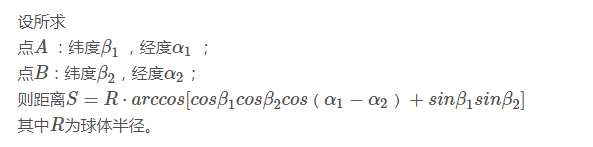

### 对地图上的点进行聚类

背景：假如有这样一种情况，你的朋友Drew希望你带她去城里庆祝他的生日，由于其他一些朋友也会过来，所以需要你提供一个大家都可行的计划。Drew给了你一些他希望去的地址，这个地址的列表很长，有70个位置。我把这个列表存在文件palces.txt文件中。这些地址其实都是俄勒冈州的波特兰地区。

也就是说一晚上要去70个地方。你要决定一个将这些地方进行聚类的最佳策略，这样就可以安排交通工具抵达这些簇的质心，然后步行到每个簇内地址。Drew的清单中虽然给出了地址，但是并没有给出这些地址之间的距离远近信息，因此你要得到每个地址的纬度和经度，然后这些地址进行聚类以安排你的行程。

示例：对于地理数据应用二分K-均值算法

(1)收集数据：使用Yahoo! placeFinder API收集数据 。（由于源代码里给出了从Yahoo! placeFinder API得到的数据，所以这里直接拿来用了）   
(2)准备数据：只保留经纬度信息。   
(3)分析数据：使用matplotlib来构建一个二维数据图，其中包含簇与地图。   
(4)训练算法：训练不适用无监督学习。   
(5)测试算法：使用二分K-均值算法。  
(6)使用算法：最后的输出是包含簇及簇中心的地图。

代码中所用到求球面距离的公式：
球面距离公式是计算球面上两点间距离的公式

参考：https://blog.csdn.net/lilong117194/article/details/78483812

